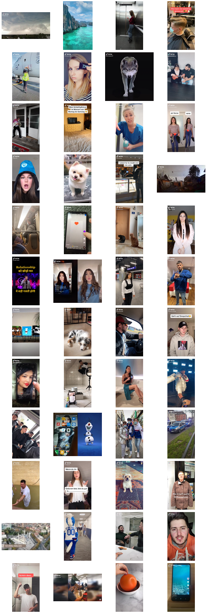

# TikTok Still Tile

Given a number of WARC files with video/mp4 content.

* [ ] extract still image from WARC
* [ ] tile them

```
$ python videostills.py --prefix stills- $(find . -name "*warc" -or -name "*warc.gz")
```

Tiling does not look super great due to lots of whitespace.

```
$ montage -tile 4x stills-* output.png
```



Identify image dimensions:

```
$ identify stills-*
stills-27PVITUNK7Z7HZ4JYDO3PQ5UKHUDR4MV.jpg JPEG 640x352 640x352+0+0 8-bit sRGB 13.1KB 0.000u 0:00.000
stills-3WJ5B4CXJBLR3BLQHRIW5JGGAM5KRBTW.jpg JPEG 540x886 540x886+0+0 8-bit sRGB 52.6KB 0.000u 0:00.000
stills-44DJYVNGJXDKVMFGAZQE7XHSG7EGORR6.jpg JPEG 720x1280 720x1280+0+0 8-bit sRGB 36.2KB 0.000u 0:00.000
stills-4PDZHQDE7BBVAEQ6DRHQSAN4AON3IHN2.jpg JPEG 720x1280 720x1280+0+0 8-bit sRGB 54.4KB 0.000u 0:00.000
stills-5RY7LJLFLJJH7EF7U5MDP6T2TZV54LXH.jpg JPEG 720x1280 720x1280+0+0 8-bit sRGB 69.5KB 0.000u 0:00.000
stills-6AICGV5C2WSCKONJ4LBXVKNU3WSYLODA.jpg JPEG 720x1280 720x1280+0+0 8-bit sRGB 64.2KB 0.000u 0:00.000
stills-7BTRXTI5A3GUP3LCQC6HDD5SPCH3KX5Y.jpg JPEG 640x640 640x640+0+0 8-bit sRGB 16.7KB 0.000u 0:00.000
stills-A2LKG5BXAKOKKPX3U3TZLFVOJVLQTA5W.jpg JPEG 720x1280 720x1280+0+0 8-bit sRGB 36.8KB 0.000u 0:00.000
stills-CAGR4DNM6PSXBIHIUNM5RNAWUKFZX43F.jpg JPEG 576x1024 576x1024+0+0 8-bit sRGB 33KB 0.000u 0:00.000
stills-CVV6CCSBNY3ABXMEVLBSUT3BIF5L3AM6.jpg JPEG 720x1280 720x1280+0+0 8-bit sRGB 45.8KB 0.000u 0:00.000
stills-DH5UUM5N2JU5KLW4FW3GR7ZZDSPLHOQC.jpg JPEG 720x1280 720x1280+0+0 8-bit sRGB 38.8KB 0.000u 0:00.000
stills-DOPESKZD5ALOKXAMIMYADEMB4AKWBDVU.jpg JPEG 720x1280 720x1280+0+0 8-bit sRGB 49.1KB 0.000u 0:00.000
stills-FYBMB4TANOQZP5A4HRORTAUW65UCPY5N.jpg JPEG 720x1280 720x1280+0+0 8-bit sRGB 45.7KB 0.000u 0:00.000
stills-GA47JDGDD62EIJJFZWEQ4EJVAXZXBI2I.jpg JPEG 540x960 540x960+0+0 8-bit sRGB 38KB 0.000u 0:00.000
stills-GPJQ3L2INZN7ZJONRK7T46XUOSD4POB5.jpg JPEG 720x1280 720x1280+0+0 8-bit sRGB 60.5KB 0.000u 0:00.000
stills-I3KJPV2T4FCJRHBVWVPZJLKDOOEMZJFO.jpg JPEG 1280x720 1280x720+0+0 8-bit sRGB 33.6KB 0.000u 0:00.000
stills-I3KXHF7Y64KR2IW36OZ4HZQGLVC6MY6R.jpg JPEG 480x848 480x848+0+0 8-bit sRGB 28.1KB 0.000u 0:00.000
stills-IAK4B5D3SKXSBYY2OYCI4K3E3ZP5SVX6.jpg JPEG 540x960 540x960+0+0 8-bit sRGB 25.1KB 0.000u 0:00.000
stills-IYEY2XVCTW2DTE65PZPKTR3ATYW6JYNE.jpg JPEG 720x1280 720x1280+0+0 8-bit sRGB 51.8KB 0.000u 0:00.000
stills-JPWKDC65MCCHYHB4NXBEEIQPIRC2HI7E.jpg JPEG 720x1280 720x1280+0+0 8-bit sRGB 42.9KB 0.000u 0:00.000
stills-JS4LXTUB62W4QWBEBLB4YTPOWRBS3JXV.jpg JPEG 432x768 432x768+0+0 8-bit sRGB 26.8KB 0.000u 0:00.000
stills-K33MHGMA7N5TFCKQYQ2AAGZLRLTN22EY.jpg JPEG 576x512 576x512+0+0 8-bit sRGB 23.4KB 0.000u 0:00.000
stills-K6RP5PJUFTN4JPI4RI2URMVOB5KOYE2O.jpg JPEG 720x1280 720x1280+0+0 8-bit sRGB 45.9KB 0.000u 0:00.000
stills-KS54KATG62JURKSKM6BJ4HF7FJHUOLV6.jpg JPEG 720x1280 720x1280+0+0 8-bit sRGB 52.4KB 0.000u 0:00.000
stills-KXKHCSWK6J2WDWECCQA4KXLE57USAVTG.jpg JPEG 540x960 540x960+0+0 8-bit sRGB 28.6KB 0.000u 0:00.000
stills-LMSR5TMJ4CNTNDQICOMBPOU2R2BYRCX7.jpg JPEG 720x1280 720x1280+0+0 8-bit sRGB 59.9KB 0.000u 0:00.000
stills-M4R66KC544SPMFWZIVI7B4XN5D4W5TD4.jpg JPEG 720x1280 720x1280+0+0 8-bit sRGB 47.7KB 0.000u 0:00.000
stills-MBYBGHYNG5V7NCSHN4NTLLS3M4ZGFCAF.jpg JPEG 720x1280 720x1280+0+0 8-bit sRGB 42.9KB 0.000u 0:00.000
stills-MMS55QYODEFYA3IPFLXTWPO7O3W2NLJX.jpg JPEG 540x960 540x960+0+0 8-bit sRGB 34.2KB 0.000u 0:00.000
stills-MOD5JMFED7HR72RJLLYZJBSVIGN5QPVW.jpg JPEG 720x1280 720x1280+0+0 8-bit sRGB 49.5KB 0.000u 0:00.000
stills-PQCO5LKH3SDHELADXZBRB7I5WCYWOGZX.jpg JPEG 720x1280 720x1280+0+0 8-bit sRGB 37.2KB 0.000u 0:00.000
stills-PRSUMZPKZ4XHKW6Z63KUJKZBGMH3DKZI.jpg JPEG 608x1080 608x1080+0+0 8-bit sRGB 34.2KB 0.000u 0:00.000
stills-PWWSC2WL2GYLTB5XW5RJ5E7C6MBP5E6T.jpg JPEG 720x1280 720x1280+0+0 8-bit sRGB 42.9KB 0.000u 0:00.000
stills-Q3VWVFZ2Q5X7WXRTY3KTMUHBLWKPRXEK.jpg JPEG 576x512 576x512+0+0 8-bit sRGB 32.5KB 0.000u 0:00.000
stills-QEQ4TTO22NFC5O43U6HKRTHNRJXPX5UC.jpg JPEG 720x1280 720x1280+0+0 8-bit sRGB 87.1KB 0.000u 0:00.000
stills-QSKVJNR3S5BXEBEMIK63FSIIAKRKEWZD.jpg JPEG 576x1024 576x1024+0+0 8-bit sRGB 70.8KB 0.000u 0:00.000
stills-QU7ATL736MZ4QHEIWP3WYKEK7YIVSZBJ.jpg JPEG 720x1280 720x1280+0+0 8-bit sRGB 31.8KB 0.000u 0:00.000
stills-RH2TN5SBZHLSD373VYHHLBU3MRC6OMFZ.jpg JPEG 720x1280 720x1280+0+0 8-bit sRGB 38KB 0.000u 0:00.000
stills-RJMWHUZ5VIZP457FUFJSE3B7SQDINQOR.jpg JPEG 720x1280 720x1280+0+0 8-bit sRGB 73.2KB 0.000u 0:00.000
stills-SEB7OLPXGFPZIYO7E5OHW7HEFEPQGB5B.jpg JPEG 720x1280 720x1280+0+0 8-bit sRGB 58.8KB 0.000u 0:00.000
stills-SHE7NDXORC4J44I2VVVKFLXOABXECEBD.jpg JPEG 400x224 400x224+0+0 8-bit sRGB 17.4KB 0.000u 0:00.000
stills-SMNKQW5O2NNHKOQ7IZ4QH5LEIMJ4Y6TG.jpg JPEG 720x1280 720x1280+0+0 8-bit sRGB 48.8KB 0.000u 0:00.000
stills-TMBAIIZWNYOAYYJPUUMQJHDXYKSETWQV.jpg JPEG 576x1024 576x1024+0+0 8-bit sRGB 31KB 0.000u 0:00.000
stills-TOE6KI5XHOX7FWCS2EF6FQDCBC654CGM.jpg JPEG 720x1280 720x1280+0+0 8-bit sRGB 43.6KB 0.000u 0:00.000
stills-U7WGDKZODQRF3GQKPIHALFBSF736T4N7.jpg JPEG 540x960 540x960+0+0 8-bit sRGB 25KB 0.000u 0:00.000
stills-WAINCYH7IASVPNXZHG7ZZCFCPU7CZDGM.jpg JPEG 960x540 960x540+0+0 8-bit sRGB 25.2KB 0.000u 0:00.000
stills-YQF4EZ3JU4QRCZJFBDDHOHGX55P7HDJA.jpg JPEG 720x1280 720x1280+0+0 8-bit sRGB 29.2KB 0.000u 0:00.000
stills-YQPB6SEM4IPP6W6N6NWTDJAYUKNYE3PY.jpg JPEG 480x848 480x848+0+0 8-bit sRGB 27.9KB 0.000u 0:00.000
```

Create optimal tiling, with minimal whitespace.

```
$ identify stills-* | cut -d ' ' -f 3 | sort | uniq -c | sort -nr
     28 720x1280
      5 540x960
      3 576x1024
      2 576x512
      2 480x848
      1 960x540
      1 640x640
      1 640x352
      1 608x1080
      1 540x886
      1 432x768
      1 400x224
      1 1280x720
```

Workaround.

```
$ montage -geometry +0+0 -tile 6x $(identify stills-* | grep "720x1280" | awk '{print $1}') output.png
```
